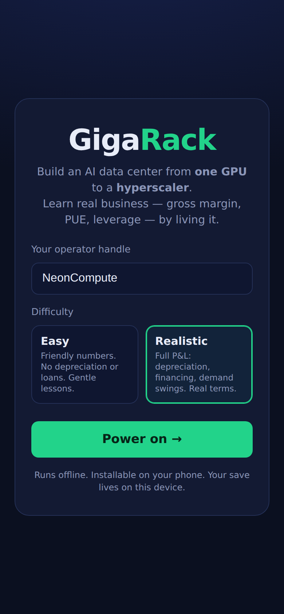
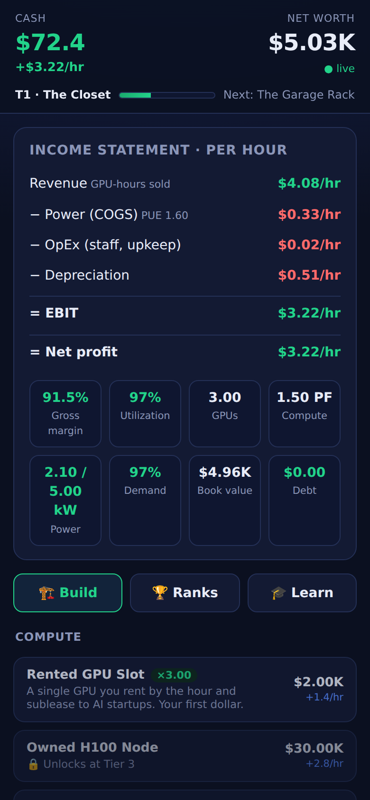
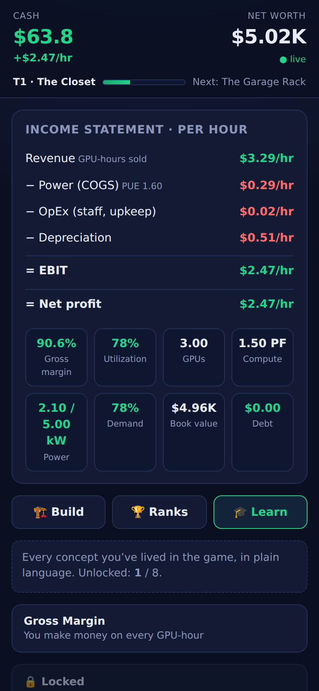
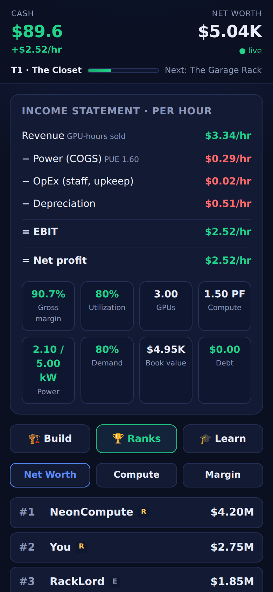

# GigaRack — AI Data Center Tycoon 🖥️⚡

> Build an AI data center from **one rented GPU** to a **global hyperscaler** — and
> learn **real business from total basics** by living it. Browser + mobile (PWA),
> idle/incremental, with a real global leaderboard.

GigaRack turns the actual economics of running AI compute into a game where the
fun loop **is a live profit-and-loss statement**. Players absorb gross margin,
CapEx vs OpEx, PUE efficiency, utilization, depreciation, leverage, and economies
of scale without realizing they're studying — because they're too busy getting rich.

It is a Progressive Web App: installable on a phone, works offline, and keeps
earning while you're away. A small backend powers a shared global leaderboard and a
market-demand index every player feels at once.

<p align="center">
  
  
  
  
</p>

## 🎮 Live demo

- **Play (GitHub Pages):** https://caytec.github.io/At-Data-center-Sim/
- **Leaderboard API (Render):** `https://gigarack-api.onrender.com` *(optional — set up for the live global board)*

Hosting both for free takes a few clicks — see **[`docs/DEPLOY.md`](docs/DEPLOY.md)**.
The game is fully playable with the frontend alone; the backend just powers the live
global leaderboard.

> Until Pages is enabled in repo settings, the link above 404s — the deploy workflow is
> included and ready; flip **Settings → Pages → Source: `gh-pages`** to go live.

---

## Why this exists

The "data center tycoon" genre is full of shallow clickers. **None teach the real
unit economics of AI infrastructure.** GigaRack fills that gap: every number is
anchored to real 2024–2025 figures (see [`docs/ECONOMICS.md`](docs/ECONOMICS.md)),
and every milestone hands the player a plain-language business lesson tied to what
they just experienced.

Full game design: [`docs/DESIGN.md`](docs/DESIGN.md).

---

## ▶️ Run it on your laptop (one command)

Requires **Node 22+** (the backend uses the built-in `node:sqlite`). Then:

```bash
git clone https://github.com/caytec/At-Data-center-Sim.git
cd At-Data-center-Sim
git checkout claude/ai-datacenter-simulator-teaching-o8udoe
npm install
npm run dev
```

`npm run dev` starts **both** the backend (`http://localhost:8787`) and the game
(`http://localhost:5173`) in one terminal, with labeled output; press **Ctrl+C** to stop
both. Now open **http://localhost:5173**, pick a difficulty, and power on.

> Already have the repo? Just `git pull && npm install && npm run dev`.
> On your phone: open the LAN URL Vite prints (same Wi‑Fi) and "Add to Home Screen" to
> install it as an app.

### Run the pieces separately (optional)

```bash
npm run dev:server     # backend only → http://localhost:8787
npm run dev:web        # game only    → http://localhost:5173
```

### Other scripts

```bash
npm test               # run the economics-engine golden tests (Vitest)
npm run build          # type-check + production-build the PWA into web/dist
npm run preview        # preview the production build
```

---

## How it plays

- **Zero → hero** across 8 tiers: *The Closet → Garage Rack → Server Room → Data
  Hall → Financed Expansion → Hyperscale Campus → Multi-Region → IPO.*
- **Buy compute, power, cooling, and staff.** GPUs earn revenue; power burns cash;
  cooling lowers your PUE; staff and power capacity unlock higher utilization.
- **Two difficulty modes.** *Easy* hides depreciation/financing with friendly
  numbers; *Realistic* runs the full P&L with demand swings and loans.
- **Learn by doing.** Milestones pop a **lesson card**; everything you've learned
  lives in the **Codex**.
- **Compete.** Scores push to global leaderboards (Net Worth, Compute, Margin)
  every ~30s. Offline? Scores queue and sync when you reconnect.

---

## Architecture

Monorepo (npm workspaces).

```
web/      React + Vite + TypeScript PWA
  src/engine/   pure, framework-agnostic economics engine (the source of "realism")
  src/data/     tunable balance: components, tiers, lessons
  src/state/    live store, persistence, offline progress
  src/net/      leaderboard API client + offline submission queue
  src/ui/       dashboard (P&L), build panel, lessons, leaderboard
server/   Node + node:http + node:sqlite backend (ZERO runtime dependencies)
  src/index.ts  HTTP routes: /demand, /leaderboard, /scores, /health
  src/db.ts     SQLite persistence (best-score-per-board upsert)
  src/validate.ts  anti-cheat: rejects values implausible for time played
docs/     DESIGN.md (game design) + ECONOMICS.md (the model + real-world sources)
```

The **economics engine is pure TypeScript with no UI dependencies**, so it is unit
tested in isolation (`npm test`) and is the single source of truth for balance.
Golden-number tests pin the model so "realism" can't silently drift.

---

## API (backend)

| Method | Path                                   | Purpose                                   |
| ------ | -------------------------------------- | ----------------------------------------- |
| `GET`  | `/health`                              | Liveness check                            |
| `GET`  | `/demand`                              | Shared global market-demand index (0–1.05)|
| `GET`  | `/leaderboard?board=&playerId=`        | Top 50 + your standing (`networth`/`compute`/`efficiency`) |
| `POST` | `/scores`                              | Submit a score (validated, best-kept)     |

The client base URL is configurable via `VITE_API_URL` (see `web/.env.example`).
If the backend is unreachable, the game stays fully playable: demand falls back to
a baseline and score submissions queue locally.

---

## Deploying

- **Game (`web/`):** any static host (Vercel/Netlify/Cloudflare Pages/GitHub Pages).
  `npm run build -w web` → deploy `web/dist`. Set `VITE_API_URL` to your backend.
- **Backend (`server/`):** any Node 22+ host (Render/Railway/Fly/a small VM).
  `npm run start -w server`. Set `PORT` and a writable `GIGARACK_DB` path.

---

## Roadmap

Tiers 6–8 (hyperscale, multi-region, IPO/prestige) are wired as data and unlock
late-game components today; deepening them, plus guilds/seasons and a player-driven
compute market, are the next social layers. See [`docs/DESIGN.md`](docs/DESIGN.md).

## License

MIT.
